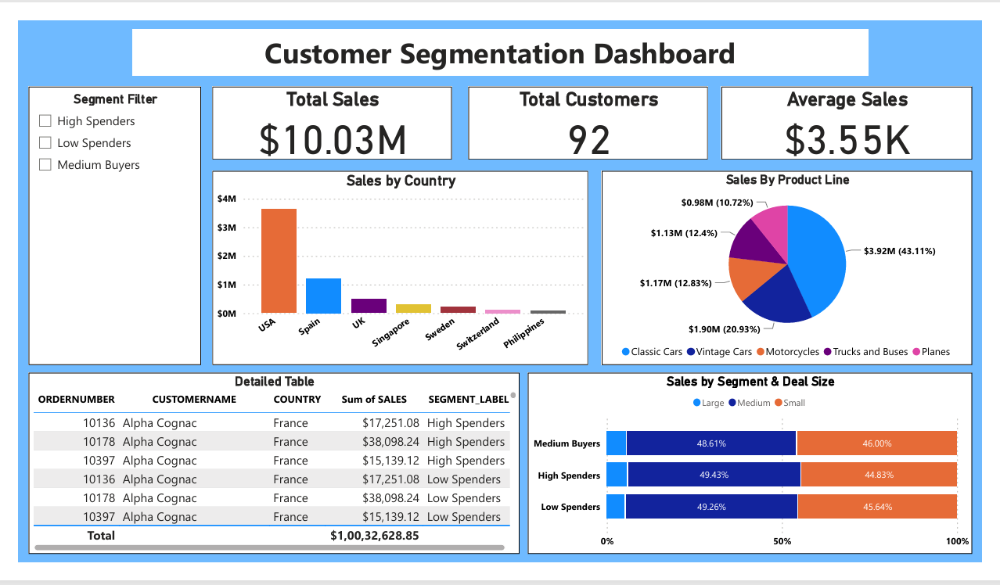

# 📊 Customer Segmentation Analysis with Power BI & Python

This project was part of my Data Analyst Internship at **Aspire Interns**, where I performed customer segmentation using sales data and developed a dashboard in Power BI for business insights.

---

## 🧠 Project Objectives
- Segment customers based on purchasing behavior.
- Analyze sales across countries, product lines, and deal sizes.
- Deliver actionable business insights through a dynamic dashboard.

---

## 🔎 Dataset Overview
The dataset included customer orders with features like:
- Product Line
- Country
- Deal Size
- Quantity Ordered
- Price Each
- Sales

---

## 🛠 Tools & Technologies
- **Python**: Data cleaning, preprocessing, clustering (KMeans)
- **Pandas**, **Scikit-learn**, **Matplotlib**, **Seaborn**
- **Power BI**: Dashboard creation
- **Git & GitHub**: Version control and sharing

---

## 📌 Step-by-Step Workflow

1. **Data Cleaning**  
   - Checked for nulls and duplicates  
   - Verified and adjusted data types

2. **Feature Engineering**  
   - Added new features: e.g., Average Sales, Segment Label  
   - One-hot encoded categorical variables

3. **Scaling**  
   - Standardized numerical features for clustering

4. **Customer Segmentation**  
   - Applied KMeans clustering (3 clusters: High, Medium, Low Spenders)  
   - Visualized clusters using scatter plots

5. **Dashboard Creation in Power BI**  
   - Imported cleaned and clustered dataset  
   - Built interactive visuals:
     - Cards for Total Sales, Total Customers, Avg Sales
     - Bar chart: Sales by Country
     - Pie chart: Sales by Product Line
     - Stacked bar: Segment vs Deal Size
     - Table: Customer-wise Sales
     - Segment Filter slicer

---

## 📈 Key Findings

- **USA** contributed the highest sales.
- **Classic Cars** were the top-selling product line.
- Customers were well-segmented into **High**, **Medium**, and **Low Spenders**.
- Deal size had a visible pattern across spending segments.
- **Scatter plot** (from Python) showed that higher prices and sales correlated with specific customer segments.

---

## 📁 Project Structure

customer-segmentation/
├── customer_segmentation.ipynb
├── segmented_customers.csv
├── Customer_Segmentation_Dashboard.pbix
├── dashboard_screenshot.png
├── README.md

## 📸 Dashboard Preview

---

## 🔗 Connect with Me
📧 Email: dodake.shilpesh2002@gmail.com  
💼 [LinkedIn](https://linkedin.com/in/shilpesh-dodake-104861326/)

---

⭐ *Feel free to fork this repo, give it a star, or suggest improvements!*
